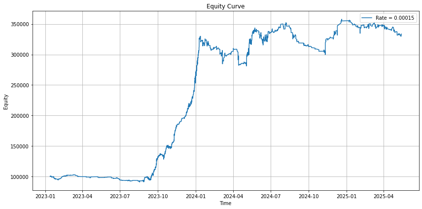
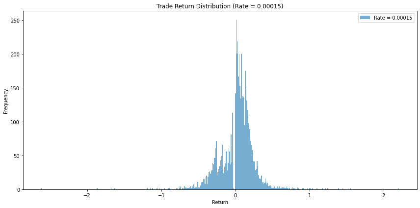

# Extreme Mean Reversion Ladder

Research idea: Fade sharp one‑way crypto moves to harvest the subsequent snap‑back.

Extreme price extensions in crypto often stem from forced liquidations executed via market orders.
Once a liquidation event exhausts, the price typically snaps back, retracing part of the move.

Systematically fading such moves can offer a repeatable edge.

---

## Strategy Overview

| Step                     | Action             | Detail                                                                                                                                              |
| ------------------------ | ------------------ | --------------------------------------------------------------------------------------------------------------------------------------------------- |
| **1 — Detect**           | Measure volatility | Compute a **9‑minute** rolling high–low range `R`.                                                                                                  |
| **2 — Enter via Ladder** | Place limit orders | Ladder extreme limits at multiples of **R**. Every price level touched inside the signal bar is treated as filled.                                  |
| **3 — Exit Rules**       | Manage positions   | • **Take‑profit:** `(Mean − Entry price) ÷ 2`, resting limits.   • **Shared stop‑loss:** `Entry ± 9 × R`, executed at market with modeled slippage. |

---

### Trading Costs & Slippage

* **Commissions:** `0.015 %` per side
* **Slippage on stop:** assume `0.30 %` + `0.05 %` extra market‑order fee

---

## Results — TRB‑USDT Backtest

| Trades | Win‑rate % | Avg return % | Avg win % | Avg loss % | Avg hold win (min) | Avg hold loss (min) | Profit factor | Max DD % |
| ------ | ---------- | ------------ | --------- | ---------- | ------------------ | ------------------- | ------------- | -------- |
| 5 487  | 69.44      | 0.022        | 0.134     | −0.233     | 1.84               | 2.37                | 1.25          | −14.91   |

## Conclusion

Results look promising during periods of extreme volatility. Implementing a more advanced volatility filter could help achieve even better performance.
As even under **large slippage assumptions** (0.30 % stop impact + 0.05 % market fee), the ladder maintains overall positive expectancy.

---

## Open Question

* Can the strategy remain viable if position size is kept small enough to keep slippage small?

---

## TODO / Next Steps

* **Model** a deeper backtest incorporating full order‑book & tick‑level trade data.
* **Live test** the strategy with small size to capture real slippage & execution metrics.